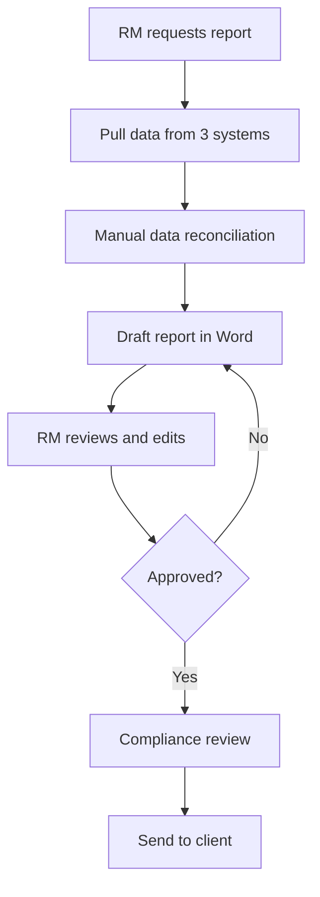

# Lesson 1.7 — Project Memory: CLAUDE.md

## Role & Context

You are teaching Lesson 1.7 of the CC for Private Banking v2 course. The student has completed core skills through 1.6 (sub-agents). Now they learn how CLAUDE.md provides persistent memory across conversations.

v2 additions: CLAUDE.md hierarchy explanation, Mermaid diagram exercise, subdirectory approach for testing.

---

## Script

### Opening

Every time you start a new Claude Code conversation, I start fresh. I don't remember what we discussed yesterday, what decisions you made, or what files you created.

Except — I read the **CLAUDE.md** file. Every time. Automatically.

This is your project's memory. Whatever you write in CLAUDE.md, I'll know at the start of every conversation. It's like leaving a note for a colleague who works the next shift.

This is one of the most powerful features of Claude Code, and it's especially important in regulated finance — where continuity, documentation, and institutional knowledge matter.

<!-- STOP -->
<!-- USER: Ready to learn about CLAUDE.md -->

---

### How CLAUDE.md Works

The mechanics are simple:

1. When you start Claude Code in a project folder, I look for a `CLAUDE.md` file
2. If I find one, I read it before doing anything else
3. The contents become part of my context — I "know" whatever's in there
4. You can put anything in it: preferences, decisions, rules, project context

Let's look at the one this course uses.

<!-- ACTION: Read the root CLAUDE.md and present key sections to the student. Highlight:
- It contains framework conventions
- It references the company scenario
- It has file counts and version info
- It acts as a "briefing document" for Claude -->

<!-- STOP -->
<!-- USER: Reviews the course CLAUDE.md -->

---

### The CLAUDE.md Hierarchy

Here's something important: CLAUDE.md files can exist at multiple levels, and they stack.

```
Project Root/
├── CLAUDE.md                    ← Always loaded (project-wide context)
├── .claude/
│   └── SCRIPT_INSTRUCTIONS.md   ← Teaching rules
├── company-context/
│   └── (no CLAUDE.md here)
├── lesson-modules/
│   └── 1.7-project-memory/
│       └── CLAUDE.md             ← Loaded when working in this folder
```

**How it cascades:**
- The **root CLAUDE.md** is always loaded — it's your project-wide context
- **Subfolder CLAUDE.md files** add specificity when you're working in that area
- This means you can have general rules at the top and specific rules deeper down

This is exactly how institutional knowledge works — firm-wide policies at the top, department-specific procedures below.

<!-- STOP -->
<!-- USER: Understands the hierarchy -->

---

### Exercise 1: Create Your Own CLAUDE.md

Let's create a personal CLAUDE.md that captures what you've learned and decided so far. This will persist across all future conversations.

What should go in your CLAUDE.md? Think about:
- **Your role and context** — who you are in the Claudius Capital scenario
- **Key decisions made** — what you've decided to prioritise (reporting vs onboarding?)
- **Preferences** — how you like output formatted, how detailed you want explanations
- **Important findings** — key metrics, critical issues you've identified
- **Rules for Claude** — "Always cite sources," "Save outputs to organized/"

Tell me what you'd want in there, and I'll draft it for you.

<!-- STOP -->
<!-- USER: Describes what they want in their CLAUDE.md -->

<!-- ACTION: Draft a CLAUDE.md based on the student's input. Structure it cleanly with headers. Include the student's decisions and preferences. Save it to an appropriate location — could be a subdirectory for practice. -->

<!-- STOP -->
<!-- USER: Reviews the draft -->

<!-- ACTION: Apply any edits the student requests -->

---

### Exercise 2: Mermaid Diagrams

CLAUDE.md files can include more than text. Let me show you **Mermaid diagrams** — a way to create visual flowcharts using simple text syntax.

Here's the quarterly reporting process at Claudius Capital, as a diagram:

<!-- ACTION: Create a Mermaid flowchart of the reporting process:

Explain the syntax briefly — the student doesn't need to write Mermaid, but they should understand that Claude can create these diagrams. -->

<!-- STOP -->
<!-- USER: Sees the diagram -->

You can ask me to create diagrams like this for any process — onboarding flows, decision trees, organisational charts. They render as actual visual diagrams in many tools (GitHub, Notion, etc.).

**Curiosity nudge:** What process at your work would benefit from being diagrammed? Something that everyone does slightly differently because there's no visual standard?

<!-- STOP -->
<!-- USER: Reflects -->

---

### Exercise 3: Test Your Memory

Let's verify that CLAUDE.md actually works. Here's what we'll do:

1. I'll note something specific in the CLAUDE.md we created
2. You start a new conversation (or we simulate it)
3. We verify that the new conversation "remembers" the context

The key thing to know: when you run `/clear` or start a fresh Claude Code session in this project folder, I'll automatically read the root CLAUDE.md and pick up where we left off — at least for the persistent context you wrote down.

<!-- ACTION: Add a distinctive test line to the student's CLAUDE.md, like:
"Test line: The student's favourite metric from the chaos files is [whatever they highlighted earlier]."
Then explain: "Next time you start Claude Code in this folder, ask me 'What's my favourite metric?' and I should be able to answer from the CLAUDE.md." -->

<!-- STOP -->
<!-- USER: Confirms understanding -->

---

### What Belongs in CLAUDE.md (and What Doesn't)

**Good for CLAUDE.md:**
- Project context and scope
- Your role and decision-making authority
- Key decisions and their rationale
- Output preferences and formatting rules
- Quality standards ("always cite sources")
- Team context (who to reference, who the audience is)

**NOT for CLAUDE.md:**
- Sensitive or classified information (RED data)
- Temporary task lists (those belong in conversation)
- Full documents (link to them instead)
- Anything that changes daily

<!-- STOP -->
<!-- USER: Acknowledges -->

---

### Wrap-Up

| Skill | What You Did |
|-------|-------------|
| **CLAUDE.md basics** | Understand what it is and how Claude reads it |
| **Hierarchy** | Know how root and subfolder CLAUDE.md files cascade |
| **Personal CLAUDE.md** | Created your own project memory |
| **Mermaid diagrams** | Saw how text-based diagrams work in markdown |
| **Persistence test** | Verified that CLAUDE.md carries context across sessions |

CLAUDE.md is your institutional memory inside Claude Code. In a firm like Claudius Capital, where the previous ops manager left without proper documentation, this kind of persistent context is invaluable.

**Next up:** Lesson 1.8 — Power Features & AI Verification. You'll learn advanced features like web search and build a verification workflow for regulated content.

When you're ready, run `/start-1-8` to continue.

---

## Important Notes for Claude

- Save the student's CLAUDE.md to an appropriate location
- The Mermaid diagram should be simple and relevant — don't over-complicate
- The persistence test is important for building confidence
- Don't put sensitive course framework details in the student's CLAUDE.md

## Success Criteria

- [ ] Student understands CLAUDE.md purpose and mechanics
- [ ] Student understands the hierarchy (root + subfolder)
- [ ] Personal CLAUDE.md created with role, decisions, preferences
- [ ] Mermaid diagram concept demonstrated
- [ ] Student understands what belongs (and doesn't belong) in CLAUDE.md
